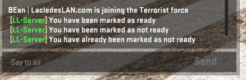

This repository is maintained by [Laclede's LAN](https://lacledeslan.com). Its contents are heavily tailored and tweaked for use at our charity LAN-Parties. For third-parties we recommend using this repo only as a reference example and then building your own using [gamesvr-csgo](https://github.com/LacledesLAN/gamesvr-csgo) as the base image for your customized server.

## Linux

[](https://microbadger.com/images/lacledeslan/gamesvr-csgo-tourney "Get your own version badge on microbadger.com")
[](https://microbadger.com/images/lacledeslan/gamesvr-csgo-tourney "Get your own image badge on microbadger.com")

### Download

```
docker pull lacledeslan/gamesvr-csgo-tourney;
```

### Run self tests

The image includes a test script that can be used to verify its contents. No changes or pull-requests will be accepted to this repository if any tests fail.

```
docker run --rm lacledeslan/gamesvr-csgo-tourney ./ll-tests/gamesvr-csgo-tourney.sh;
```

## Tournament Flow
Game flow is largely controlled by [Warmod [BFG]](https://forums.alliedmods.net/showthread.php?t=225474).

Server starts in *warm up* mode where players can toggle themselves as `/ready`. Once all ten players are ready *knife mode* begins. The purpose of the knife mode is to assign sides fairly. It lasts for a single round and does not count as a win for either team.

Last player standing at the end of *knife mode* gets to decide which side to start on (CT or T) by typing either `/stay` or `/switch`.

Another *warm up* mode begins; once all players are ready "live on three" runs and live play begins.

Half-time starts after 15 rounds and lasts 30 seconds. Players sides are swapped.

At the end scoreboard shows and server freezes.

## Useful Server Commands

For a full list of CSGO server commands check [documentation on dathost](http://tools.dathost.net/csgo-commands).

> *Note: Only precede commands with `/` inside the CSGO game client (e.g. rcon) - using the `/` in tools (e.g. HLSW) or in the server's terminal will result in the command failing.*

* `/changelevel <levelname>` - Change server to the specified map
* `/mp_pause_match` - Pause the match in the next freeze time
* `/mp_unpause_match` - Resume a paused match
* `/status` - Get a quick overview of the server's current state
* `/sv_password <new password>` - Change the server's password

## Useful Warmod [BFG] Commands
For a full list of Warmod commands [check the official documentation](https://forums.alliedmods.net/showthread.php?t=225474).

#### CLIENT (Player) Commands
* `/info` - Displays who's ready if panel was closed (warmup mode only)
* `/ready` - Marks you as ready (warmup mode only)
* `/scores` - Display scores (live play only)
* `/unready` - Marks you as unready (warmup mode only)

#### Admin Commands
* `/forceallready` - Forces all players to become ready.
* `/forceallunready` - Forces all players to become unready.
* `/forcestart` - Starts the match regardless of player and ready count.
* `/forceend` - Ends the match regardless of status.
* `/minready` - Set or display the wm_min_ready console variable.
* `/maxrounds <num>` - Set or display the wm_max_rounds console variable
* `/aswap` - Manually swaps all players to the opposite team
* `/t` & `/ct` - Set the Terrorist and Counter-Terrorist team names (note: doesn't change the the cvars *wm_t* or *wm_ct*).

### Round Restore

At the start of every round the server writes a file called *LL_round##.txt* which can be loaded to restore the previous round. After a round is restored the game will be paused; when all players are ready unpause with `mp_unpause_match`. Players will need to hit "3" in order to discard the WarMod message and they can continue on.

There are a lot of pitfalls so please read warnings carefully. It is **highly* recommended you use [Snippet-Generator](https://github.com/LacledesLAN/Snippet-Generator) to run round restores.

*Note: Be sure you're using the right number. **File names are "zero-indexed"**. `LL_round00.txt` is for round 1, `LL_round01.txt` is round 2, and so on.*

After a game resets (for example if a *changelevel* command was issued) the server will start over, over-writing any existing files starting with LL_round00.txt.

**WARNINGS:**

* Issuing the wrong round restore command may restore a round from a previous game.
* There is a bug with WarMod [BFG] where grenades become disabled after issuing a round restore; the command `wm_block_warm_up_grenades 0` must be used to restore.
* There is a bug with CSGO where the restore command frequently doesn't work and must be typed twice.

To restore round 5 you would issue:

```(shell)
mp_backup_restore_load_file LL_round04; mp_backup_restore_load_file LL_round04; wm_block_warm_up_grenades 0;
```

Then once all players are ready issue the command `mp_unpause_match;`.

## Troubleshooting

### Client Checks

The following checks can be preformed from a connected CSGO game client to ensure everything is working properly.

#### Verify Metamod and SourceMod are Working

Press `y` to open game chat; then type `!sm_admin`. Either the text "you do not have access to this command" should be displayed or a menu should pop up.

#### Verify WarMod [BFG] is Loaded

Press `y` to open game chat and enter `/info`. Warmod should be listed in the output.

#### Verify LL Config is Loaded

Messages generated by Warmod should be prepended with “**[LL-Server]**” (not “[Warmod]”) in the chat window (press `y` to bring up). An easy way to get Warmod to generate a message would be by using the `/ready` or `/unready` commands.



## Getting Started with Game Servers in Docker

[Docker](https://docs.docker.com/) is an open-source project that bundles applications into lightweight, portable, self-sufficient containers. For a crash course on running Dockerized game servers check out [Using Docker for Game Servers](https://github.com/LacledesLAN/README.1ST/blob/master/GameServers/DockerAndGameServers.md). For tips, tricks, and recommended tools for working with Laclede's LAN Dockerized game server repos see the guide for [Working with our Game Server Repos](https://github.com/LacledesLAN/README.1ST/blob/master/GameServers/WorkingWithOurRepos.md). You can also browse all of our other Dockerized game servers: [Laclede's LAN Game Servers Directory](https://github.com/LacledesLAN/README.1ST/tree/master/GameServers).
